# Correlation analysis of crimes in NSW

Python code to analyse relationships among crimes in NSW based on data from the NSW Bureau of Crime Statistics and Research.

# Loading libraries

Let's load relevant Python libraries.


```python
import numpy as np 
import pandas as pd 
import seaborn as sns 
import matplotlib.pyplot as plt 
import matplotlib as mpl
from IPython.display import display, Markdown
from itertools import cycle
import time
import warnings
warnings.filterwarnings("ignore")
```

# Loading data

The original data acquired from https://www.bocsar.nsw.gov.au/Pages/bocsar_datasets/Datasets-.aspxNSW. It contains monthly data on all criminal incidents recorded by police from 1995 to Mar 2020. It was processed and cleaned https://github.com/codegression/Predicting-domestic-voilence-in-NSW. Now we are going to use the processed file.


```python
data = pd.read_csv('crimes_nsw.csv', index_col=0, parse_dates=True)
```


```python
data.head()
```


<div>
<table border="1" class="dataframe">
  <thead>
    <tr style="text-align: right;">
      <th></th>
      <th>Murder</th>
      <th>Attempted murder</th>
      <th>Murder accessory, conspiracy</th>
      <th>Manslaughter</th>
      <th>Domestic violence related assault</th>
      <th>Non-domestic violence related assault</th>
      <th>Assault Police</th>
      <th>Sexual assault</th>
      <th>Indecent assault, act of indecency and other sexual offences</th>
      <th>Abduction and kidnapping</th>
      <th>...</th>
      <th>Pornography offences</th>
      <th>Prostitution offences</th>
      <th>Escape custody</th>
      <th>Breach Apprehended Violence Order</th>
      <th>Breach bail conditions</th>
      <th>Fail to appear</th>
      <th>Resist or hinder officer</th>
      <th>Other offences against justice procedures</th>
      <th>Transport regulatory offences</th>
      <th>Other offences</th>
    </tr>
  </thead>
  <tbody>
    <tr>
      <th>1995-01-01</th>
      <td>9</td>
      <td>1</td>
      <td>0</td>
      <td>0</td>
      <td>613</td>
      <td>2416</td>
      <td>196</td>
      <td>237</td>
      <td>394</td>
      <td>15</td>
      <td>...</td>
      <td>2</td>
      <td>49</td>
      <td>36</td>
      <td>266</td>
      <td>135</td>
      <td>141</td>
      <td>397</td>
      <td>301</td>
      <td>40</td>
      <td>596</td>
    </tr>
    <tr>
      <th>1995-02-01</th>
      <td>11</td>
      <td>3</td>
      <td>2</td>
      <td>2</td>
      <td>591</td>
      <td>2277</td>
      <td>177</td>
      <td>157</td>
      <td>350</td>
      <td>16</td>
      <td>...</td>
      <td>3</td>
      <td>17</td>
      <td>29</td>
      <td>241</td>
      <td>115</td>
      <td>143</td>
      <td>347</td>
      <td>294</td>
      <td>57</td>
      <td>516</td>
    </tr>
    <tr>
      <th>1995-03-01</th>
      <td>10</td>
      <td>4</td>
      <td>0</td>
      <td>1</td>
      <td>625</td>
      <td>2379</td>
      <td>181</td>
      <td>199</td>
      <td>438</td>
      <td>23</td>
      <td>...</td>
      <td>4</td>
      <td>35</td>
      <td>34</td>
      <td>292</td>
      <td>144</td>
      <td>135</td>
      <td>338</td>
      <td>387</td>
      <td>57</td>
      <td>560</td>
    </tr>
    <tr>
      <th>1995-04-01</th>
      <td>11</td>
      <td>6</td>
      <td>0</td>
      <td>2</td>
      <td>640</td>
      <td>2160</td>
      <td>177</td>
      <td>188</td>
      <td>341</td>
      <td>22</td>
      <td>...</td>
      <td>1</td>
      <td>52</td>
      <td>24</td>
      <td>285</td>
      <td>131</td>
      <td>121</td>
      <td>322</td>
      <td>304</td>
      <td>53</td>
      <td>492</td>
    </tr>
    <tr>
      <th>1995-05-01</th>
      <td>7</td>
      <td>5</td>
      <td>2</td>
      <td>1</td>
      <td>602</td>
      <td>2128</td>
      <td>131</td>
      <td>148</td>
      <td>346</td>
      <td>14</td>
      <td>...</td>
      <td>3</td>
      <td>35</td>
      <td>23</td>
      <td>286</td>
      <td>139</td>
      <td>158</td>
      <td>289</td>
      <td>386</td>
      <td>86</td>
      <td>616</td>
    </tr>
  </tbody>
</table>
<p>5 rows × 62 columns</p>
</div>


# Exploratory data analysis

Let's analyze all the 62 types of crimes. 


```python
np.random.seed(4)
colors = np.random.choice(list(mpl.colors.XKCD_COLORS.keys()), len(data.columns), replace=False)
cycler = cycle('bgrcmk')
```


```python
for i in range(len(data.columns)):
    data[data.columns[i]].plot(kind = 'line', color =colors[i],linewidth=2,alpha = 1,grid = True,linestyle = '-')
plt.legend(loc='upper right')     
plt.legend(bbox_to_anchor=(1.05, 1))   
plt.xlabel('')              
plt.ylabel('Number of cases')
plt.title('Monthly plot of various crimes in NSW')            
plt.show()
```


Let's look at individual plots.


```python
np.random.seed(4)
colors = np.random.choice(list(mpl.colors.XKCD_COLORS.keys()), len(data.columns), replace=False)
for i in range(len(data.columns)):
    data[data.columns[i]].plot(kind = 'line', color=colors[i],linewidth=2,alpha = 1,grid = True,linestyle = '-')
    plt.legend(loc='upper right')     
    plt.legend(bbox_to_anchor=(1.05, 1))   
    plt.xlabel('')              
    plt.ylabel('Number of cases')
    plt.title('')            
    plt.show()
```


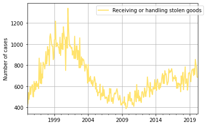


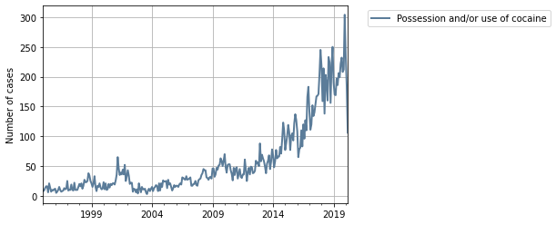


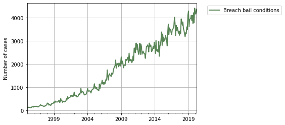


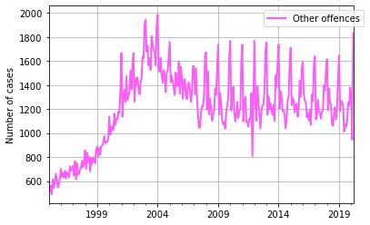


# Set up for corelation analysis

Let's compute pairwise Pearson correlation of columns


```python
corr = data.corr()
```


```python
corr.head()
```


<div>
<table border="1" class="dataframe">
  <thead>
    <tr style="text-align: right;">
      <th></th>
      <th>Murder</th>
      <th>Attempted murder</th>
      <th>Murder accessory, conspiracy</th>
      <th>Manslaughter</th>
      <th>Domestic violence related assault</th>
      <th>Non-domestic violence related assault</th>
      <th>Assault Police</th>
      <th>Sexual assault</th>
      <th>Indecent assault, act of indecency and other sexual offences</th>
      <th>Abduction and kidnapping</th>
      <th>...</th>
      <th>Pornography offences</th>
      <th>Prostitution offences</th>
      <th>Escape custody</th>
      <th>Breach Apprehended Violence Order</th>
      <th>Breach bail conditions</th>
      <th>Fail to appear</th>
      <th>Resist or hinder officer</th>
      <th>Other offences against justice procedures</th>
      <th>Transport regulatory offences</th>
      <th>Other offences</th>
    </tr>
  </thead>
  <tbody>
    <tr>
      <th>Murder</th>
      <td>1.000000</td>
      <td>0.365231</td>
      <td>0.138157</td>
      <td>0.053442</td>
      <td>-0.289604</td>
      <td>0.120521</td>
      <td>0.147452</td>
      <td>-0.379037</td>
      <td>-0.210921</td>
      <td>0.169820</td>
      <td>...</td>
      <td>-0.403237</td>
      <td>0.238803</td>
      <td>0.337264</td>
      <td>-0.308997</td>
      <td>-0.405640</td>
      <td>0.376940</td>
      <td>-0.049425</td>
      <td>0.311993</td>
      <td>-0.422865</td>
      <td>-0.196618</td>
    </tr>
    <tr>
      <th>Attempted murder</th>
      <td>0.365231</td>
      <td>1.000000</td>
      <td>0.252897</td>
      <td>0.194512</td>
      <td>-0.382778</td>
      <td>0.331245</td>
      <td>0.341831</td>
      <td>-0.507649</td>
      <td>-0.349312</td>
      <td>0.359998</td>
      <td>...</td>
      <td>-0.599237</td>
      <td>0.424611</td>
      <td>0.616458</td>
      <td>-0.354095</td>
      <td>-0.638149</td>
      <td>0.562178</td>
      <td>0.035280</td>
      <td>0.386166</td>
      <td>-0.610551</td>
      <td>-0.122431</td>
    </tr>
    <tr>
      <th>Murder accessory, conspiracy</th>
      <td>0.138157</td>
      <td>0.252897</td>
      <td>1.000000</td>
      <td>-0.003660</td>
      <td>-0.112756</td>
      <td>0.114272</td>
      <td>0.092305</td>
      <td>-0.192342</td>
      <td>-0.174581</td>
      <td>0.168598</td>
      <td>...</td>
      <td>-0.211005</td>
      <td>0.103580</td>
      <td>0.161519</td>
      <td>-0.138872</td>
      <td>-0.226745</td>
      <td>0.150228</td>
      <td>0.018631</td>
      <td>0.084419</td>
      <td>-0.215765</td>
      <td>-0.017777</td>
    </tr>
    <tr>
      <th>Manslaughter</th>
      <td>0.053442</td>
      <td>0.194512</td>
      <td>-0.003660</td>
      <td>1.000000</td>
      <td>-0.137801</td>
      <td>0.076565</td>
      <td>0.110997</td>
      <td>-0.127899</td>
      <td>-0.045221</td>
      <td>0.100293</td>
      <td>...</td>
      <td>-0.185314</td>
      <td>0.199467</td>
      <td>0.223375</td>
      <td>-0.127315</td>
      <td>-0.200212</td>
      <td>0.218109</td>
      <td>-0.016614</td>
      <td>0.215255</td>
      <td>-0.211501</td>
      <td>-0.106784</td>
    </tr>
    <tr>
      <th>Domestic violence related assault</th>
      <td>-0.289604</td>
      <td>-0.382778</td>
      <td>-0.112756</td>
      <td>-0.137801</td>
      <td>1.000000</td>
      <td>0.268514</td>
      <td>0.329355</td>
      <td>0.701932</td>
      <td>0.494574</td>
      <td>-0.102251</td>
      <td>...</td>
      <td>0.623767</td>
      <td>-0.430343</td>
      <td>-0.526837</td>
      <td>0.915471</td>
      <td>0.753355</td>
      <td>-0.654952</td>
      <td>0.623879</td>
      <td>-0.709158</td>
      <td>0.701029</td>
      <td>0.771534</td>
    </tr>
  </tbody>
</table>
<p>5 rows × 62 columns</p>
</div>


Let's plot a heatmap of the correlation matrix where highly correlated pairs are colored in pink.


```python
mask = np.triu(np.ones_like(corr, dtype=np.bool))
f, ax = plt.subplots(figsize=(11, 9))
cmap = sns.diverging_palette(220, 10, as_cmap=True)
sns.heatmap(corr, mask=mask, cmap=cmap, vmax=.3, center=0,
            square=True, linewidths=.5)
```


    <AxesSubplot:>


Since the correlation table is too big, let's loop through column by column. Let's set the threshold as 0.8 and find strongly positively and negatively correlated columns.


```python
threshold = 0.8
for column in corr.columns:
    targetcolumn = corr[column]
    filteredcolumn = targetcolumn[((targetcolumn>threshold) & (targetcolumn<1))|
                                  ((targetcolumn<-threshold) & (targetcolumn>-1))]
    
    display(Markdown("# Crimes correlated with '" + column + "'"))
    if len(filteredcolumn)==0:
         display(Markdown('None'))
    else:
        print(filteredcolumn)
        print('')
        print('')
        np.random.seed(53)
        colors = np.random.choice(list(mpl.colors.XKCD_COLORS.keys()), len(filteredcolumn)+1, replace=False)
        data[column].plot(kind = 'line', color = colors[0],label = column,linewidth=2,alpha = 1,grid = True,linestyle = '-')
        i=1
        for index, value in list(filteredcolumn.items()):            
            data[index].plot(kind = 'line', color = colors[i],label = index,linewidth=2,alpha = 1,grid = True,linestyle = '-')
            i=i+1
        plt.legend(loc='upper right')     
        plt.legend(bbox_to_anchor=(1.05, 1))   
        plt.xlabel('')              
        plt.ylabel('Number of cases')
        plt.title('Crimes correlated with '+ column.lower())            
        plt.show()
                
        for index, value in list(filteredcolumn.items()): 
            print('')    
            display(Markdown("### Relationship between '"+ column + "' and '" + index + "'" ))
            if value > 0:
                if value > threshold * 1.125:
                    print('There is a strong positive correlation with a coefficient of ' + str(value) + ".")
                else:
                    print('There is a somewhat a weak positive correlation with a coefficient of ' + str(value) + ".")
            else:
                if value > threshold * -1.125:                    
                    print('There is a strong negative correlation with a coefficient of ' + str(-value) + '.')
                else:
                    print('There is a somewhat a weak negative correlation with a coefficient of ' + str(-value) + ".")
                
            sns.jointplot(x=column, y=index, data=data, kind="reg")  
            plt.show()             
    print('')   
    print('')
    print('')
            
   
   
```


# Crimes correlated with 'Murder'


None


    
    
    
    


# Crimes correlated with 'Attempted murder'


None


    
    
    
    


# Crimes correlated with 'Murder accessory, conspiracy'


None


    
    
    
    


# Crimes correlated with 'Manslaughter'


None


    
    
    
    


# Crimes correlated with 'Domestic violence related assault'


    Intimidation, stalking and harassment    0.877783
    Trespass                                 0.903188
    Breach Apprehended Violence Order        0.915471
    Name: Domestic violence related assault, dtype: float64
    
    
    


    
    


### Relationship between 'Domestic violence related assault' and 'Intimidation, stalking and harassment'


    There is a somewhat a weak positive correlation with a coefficient of 0.8777827279809703.
    


    
    


### Relationship between 'Domestic violence related assault' and 'Trespass'


    There is a strong positive correlation with a coefficient of 0.9031875068224001.
    


    
    


### Relationship between 'Domestic violence related assault' and 'Breach Apprehended Violence Order'


    There is a strong positive correlation with a coefficient of 0.9154707865426196.
    


    
    
    
    


# Crimes correlated with 'Non-domestic violence related assault'


None


    
    
    
    


# Crimes correlated with 'Assault Police'


None


    
    
    
    


# Crimes correlated with 'Sexual assault'


    Intimidation, stalking and harassment    0.820628
    Fraud                                    0.813483
    Possession and/or use of other drugs     0.845602
    Other drug offences                      0.809643
    Pornography offences                     0.816202
    Breach Apprehended Violence Order        0.802285
    Breach bail conditions                   0.836366
    Transport regulatory offences            0.824175
    Name: Sexual assault, dtype: float64
    
    
    


    
    


### Relationship between 'Sexual assault' and 'Intimidation, stalking and harassment'


    There is a somewhat a weak positive correlation with a coefficient of 0.8206279836753958.
    


    
    


### Relationship between 'Sexual assault' and 'Fraud'


    There is a somewhat a weak positive correlation with a coefficient of 0.813483306158548.
    


    
    


### Relationship between 'Sexual assault' and 'Possession and/or use of other drugs'


    There is a somewhat a weak positive correlation with a coefficient of 0.8456016331276149.
    


    
    


### Relationship between 'Sexual assault' and 'Other drug offences'


    There is a somewhat a weak positive correlation with a coefficient of 0.8096427611461977.
    


    
    


### Relationship between 'Sexual assault' and 'Pornography offences'


    There is a somewhat a weak positive correlation with a coefficient of 0.8162018238764369.
    


    
    


### Relationship between 'Sexual assault' and 'Breach Apprehended Violence Order'


    There is a somewhat a weak positive correlation with a coefficient of 0.8022849930996498.
    


    
    


### Relationship between 'Sexual assault' and 'Breach bail conditions'


    There is a somewhat a weak positive correlation with a coefficient of 0.8363661185268287.
    


    
    


### Relationship between 'Sexual assault' and 'Transport regulatory offences'


    There is a somewhat a weak positive correlation with a coefficient of 0.8241745573416319.
    


    
    
    
    


# Crimes correlated with 'Indecent assault, act of indecency and other sexual offences'


None


    
    
    
    


# Crimes correlated with 'Abduction and kidnapping'


None


    
    
    
    


# Crimes correlated with 'Robbery without a weapon'


    Robbery with a firearm                   0.817910
    Robbery with a weapon not a firearm      0.912416
    Break and enter dwelling                 0.915871
    Break and enter non-dwelling             0.922971
    Motor vehicle theft                      0.894368
    Steal from motor vehicle                 0.912566
    Steal from dwelling                      0.832235
    Steal from person                        0.817831
    Other theft                              0.918516
    Possession and/or use of amphetamines   -0.802590
    Possession and/or use of other drugs    -0.875181
    Pornography offences                    -0.848525
    Breach bail conditions                  -0.886626
    Transport regulatory offences           -0.866168
    Name: Robbery without a weapon, dtype: float64
    
    
    


    
    


### Relationship between 'Robbery without a weapon' and 'Robbery with a firearm'


    There is a somewhat a weak positive correlation with a coefficient of 0.8179101535342335.
    


    
    


### Relationship between 'Robbery without a weapon' and 'Robbery with a weapon not a firearm'


    There is a strong positive correlation with a coefficient of 0.9124155643893153.
    


    
    


### Relationship between 'Robbery without a weapon' and 'Break and enter dwelling'


    There is a strong positive correlation with a coefficient of 0.915871293922251.
    


    
    


### Relationship between 'Robbery without a weapon' and 'Break and enter non-dwelling'


    There is a strong positive correlation with a coefficient of 0.9229712934865935.
    


    
    


### Relationship between 'Robbery without a weapon' and 'Motor vehicle theft'


    There is a somewhat a weak positive correlation with a coefficient of 0.8943680545797406.
    


    
    


### Relationship between 'Robbery without a weapon' and 'Steal from motor vehicle'


    There is a strong positive correlation with a coefficient of 0.9125658874386346.
    


    
    


### Relationship between 'Robbery without a weapon' and 'Steal from dwelling'


    There is a somewhat a weak positive correlation with a coefficient of 0.8322349531881957.
    


    
    


### Relationship between 'Robbery without a weapon' and 'Steal from person'


    There is a somewhat a weak positive correlation with a coefficient of 0.817831258092867.
    


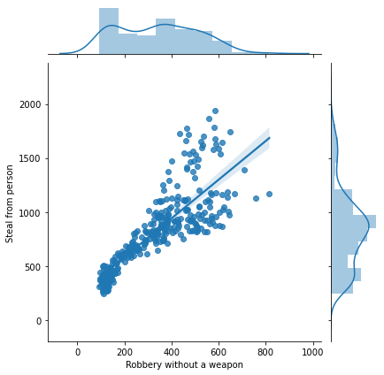


    
    


### Relationship between 'Robbery without a weapon' and 'Other theft'


    There is a strong positive correlation with a coefficient of 0.9185155995771128.
    


    
    


### Relationship between 'Robbery without a weapon' and 'Possession and/or use of amphetamines'


    There is a strong negative correlation with a coefficient of 0.8025897603176827.
    


    
    


### Relationship between 'Robbery without a weapon' and 'Possession and/or use of other drugs'


    There is a strong negative correlation with a coefficient of 0.8751809774001182.
    


    
    


### Relationship between 'Robbery without a weapon' and 'Pornography offences'


    There is a strong negative correlation with a coefficient of 0.8485247584183891.
    


    
    


### Relationship between 'Robbery without a weapon' and 'Breach bail conditions'


    There is a strong negative correlation with a coefficient of 0.8866257173115341.
    


    
    


### Relationship between 'Robbery without a weapon' and 'Transport regulatory offences'


    There is a strong negative correlation with a coefficient of 0.8661682767094265.
    


    
    
    
    


# Crimes correlated with 'Robbery with a firearm'


    Robbery without a weapon                 0.817910
    Intimidation, stalking and harassment   -0.813840
    Break and enter dwelling                 0.862604
    Break and enter non-dwelling             0.856557
    Motor vehicle theft                      0.869601
    Breach bail conditions                  -0.840473
    Transport regulatory offences           -0.804545
    Name: Robbery with a firearm, dtype: float64
    
    
    


    
    


### Relationship between 'Robbery with a firearm' and 'Robbery without a weapon'


    There is a somewhat a weak positive correlation with a coefficient of 0.8179101535342335.
    


    
    


### Relationship between 'Robbery with a firearm' and 'Intimidation, stalking and harassment'


    There is a strong negative correlation with a coefficient of 0.8138398698655399.
    


    
    


### Relationship between 'Robbery with a firearm' and 'Break and enter dwelling'


    There is a somewhat a weak positive correlation with a coefficient of 0.8626037367460345.
    


    
    


### Relationship between 'Robbery with a firearm' and 'Break and enter non-dwelling'


    There is a somewhat a weak positive correlation with a coefficient of 0.8565566288179831.
    


    
    


### Relationship between 'Robbery with a firearm' and 'Motor vehicle theft'


    There is a somewhat a weak positive correlation with a coefficient of 0.8696006295878597.
    


    
    


### Relationship between 'Robbery with a firearm' and 'Breach bail conditions'


    There is a strong negative correlation with a coefficient of 0.8404734856607098.
    


    
    


### Relationship between 'Robbery with a firearm' and 'Transport regulatory offences'


    There is a strong negative correlation with a coefficient of 0.804544580471433.
    


    
    
    
    


# Crimes correlated with 'Robbery with a weapon not a firearm'


    Robbery without a weapon        0.912416
    Break and enter dwelling        0.904436
    Break and enter non-dwelling    0.898748
    Motor vehicle theft             0.878851
    Steal from motor vehicle        0.899278
    Steal from dwelling             0.825286
    Other theft                     0.906301
    Name: Robbery with a weapon not a firearm, dtype: float64
    
    
    


    
    


### Relationship between 'Robbery with a weapon not a firearm' and 'Robbery without a weapon'


    There is a strong positive correlation with a coefficient of 0.9124155643893153.
    


    
    


### Relationship between 'Robbery with a weapon not a firearm' and 'Break and enter dwelling'


    There is a strong positive correlation with a coefficient of 0.904436479594844.
    


    
    


### Relationship between 'Robbery with a weapon not a firearm' and 'Break and enter non-dwelling'


    There is a somewhat a weak positive correlation with a coefficient of 0.8987480275926126.
    


    
    


### Relationship between 'Robbery with a weapon not a firearm' and 'Motor vehicle theft'


    There is a somewhat a weak positive correlation with a coefficient of 0.8788510876661992.
    


    
    


### Relationship between 'Robbery with a weapon not a firearm' and 'Steal from motor vehicle'


    There is a somewhat a weak positive correlation with a coefficient of 0.8992780665330264.
    


    
    


### Relationship between 'Robbery with a weapon not a firearm' and 'Steal from dwelling'


    There is a somewhat a weak positive correlation with a coefficient of 0.825286037008729.
    


    
    


### Relationship between 'Robbery with a weapon not a firearm' and 'Other theft'


    There is a strong positive correlation with a coefficient of 0.9063013764647229.
    


    
    
    
    


# Crimes correlated with 'Blackmail and extortion'


None


    
    
    
    


# Crimes correlated with 'Intimidation, stalking and harassment'


    Domestic violence related assault       0.877783
    Sexual assault                          0.820628
    Robbery with a firearm                 -0.813840
    Break and enter dwelling               -0.878417
    Break and enter non-dwelling           -0.901685
    Motor vehicle theft                    -0.917663
    Fraud                                   0.863081
    Possession and/or use of other drugs    0.848191
    Trespass                                0.895179
    Pornography offences                    0.808612
    Breach Apprehended Violence Order       0.857452
    Breach bail conditions                  0.923936
    Transport regulatory offences           0.835347
    Name: Intimidation, stalking and harassment, dtype: float64
    
    
    


    
    


### Relationship between 'Intimidation, stalking and harassment' and 'Domestic violence related assault'


    There is a somewhat a weak positive correlation with a coefficient of 0.8777827279809703.
    


    
    


### Relationship between 'Intimidation, stalking and harassment' and 'Sexual assault'


    There is a somewhat a weak positive correlation with a coefficient of 0.8206279836753958.
    


    
    


### Relationship between 'Intimidation, stalking and harassment' and 'Robbery with a firearm'


    There is a strong negative correlation with a coefficient of 0.8138398698655399.
    


    
    


### Relationship between 'Intimidation, stalking and harassment' and 'Break and enter dwelling'


    There is a strong negative correlation with a coefficient of 0.8784169796138316.
    


    
    


### Relationship between 'Intimidation, stalking and harassment' and 'Break and enter non-dwelling'


    There is a somewhat a weak negative correlation with a coefficient of 0.9016851406612229.
    


    
    


### Relationship between 'Intimidation, stalking and harassment' and 'Motor vehicle theft'


    There is a somewhat a weak negative correlation with a coefficient of 0.9176633127894716.
    


    
    


### Relationship between 'Intimidation, stalking and harassment' and 'Fraud'


    There is a somewhat a weak positive correlation with a coefficient of 0.8630809320679204.
    


    
    


### Relationship between 'Intimidation, stalking and harassment' and 'Possession and/or use of other drugs'


    There is a somewhat a weak positive correlation with a coefficient of 0.848190580081845.
    


    
    


### Relationship between 'Intimidation, stalking and harassment' and 'Trespass'


    There is a somewhat a weak positive correlation with a coefficient of 0.8951787685762429.
    


    
    


### Relationship between 'Intimidation, stalking and harassment' and 'Pornography offences'


    There is a somewhat a weak positive correlation with a coefficient of 0.8086123367997449.
    


    
    


### Relationship between 'Intimidation, stalking and harassment' and 'Breach Apprehended Violence Order'


    There is a somewhat a weak positive correlation with a coefficient of 0.8574515894111203.
    


    
    


### Relationship between 'Intimidation, stalking and harassment' and 'Breach bail conditions'


    There is a strong positive correlation with a coefficient of 0.9239357693463738.
    


    
    


### Relationship between 'Intimidation, stalking and harassment' and 'Transport regulatory offences'


    There is a somewhat a weak positive correlation with a coefficient of 0.8353471396745816.
    


    
    
    
    


# Crimes correlated with 'Other offences against the person'


None


    
    
    
    


# Crimes correlated with 'Break and enter dwelling'


    Robbery without a weapon                 0.915871
    Robbery with a firearm                   0.862604
    Robbery with a weapon not a firearm      0.904436
    Intimidation, stalking and harassment   -0.878417
    Break and enter non-dwelling             0.978589
    Motor vehicle theft                      0.974023
    Steal from motor vehicle                 0.915343
    Steal from dwelling                      0.906894
    Other theft                              0.938519
    Possession and/or use of other drugs    -0.847933
    Pornography offences                    -0.828893
    Breach bail conditions                  -0.907632
    Transport regulatory offences           -0.873356
    Name: Break and enter dwelling, dtype: float64
    
    
    


    
    


### Relationship between 'Break and enter dwelling' and 'Robbery without a weapon'


    There is a strong positive correlation with a coefficient of 0.915871293922251.
    


    
    


### Relationship between 'Break and enter dwelling' and 'Robbery with a firearm'


    There is a somewhat a weak positive correlation with a coefficient of 0.8626037367460345.
    


    
    


### Relationship between 'Break and enter dwelling' and 'Robbery with a weapon not a firearm'


    There is a strong positive correlation with a coefficient of 0.904436479594844.
    


    
    


### Relationship between 'Break and enter dwelling' and 'Intimidation, stalking and harassment'


    There is a strong negative correlation with a coefficient of 0.8784169796138316.
    


    
    


### Relationship between 'Break and enter dwelling' and 'Break and enter non-dwelling'


    There is a strong positive correlation with a coefficient of 0.9785894416184463.
    


    
    


### Relationship between 'Break and enter dwelling' and 'Motor vehicle theft'


    There is a strong positive correlation with a coefficient of 0.9740226284060512.
    


    
    


### Relationship between 'Break and enter dwelling' and 'Steal from motor vehicle'


    There is a strong positive correlation with a coefficient of 0.915343353256801.
    


    
    


### Relationship between 'Break and enter dwelling' and 'Steal from dwelling'


    There is a strong positive correlation with a coefficient of 0.9068939493270297.
    


    
    


### Relationship between 'Break and enter dwelling' and 'Other theft'


    There is a strong positive correlation with a coefficient of 0.9385187271828259.
    


    
    


### Relationship between 'Break and enter dwelling' and 'Possession and/or use of other drugs'


    There is a strong negative correlation with a coefficient of 0.8479331162880707.
    


    
    


### Relationship between 'Break and enter dwelling' and 'Pornography offences'


    There is a strong negative correlation with a coefficient of 0.8288934022621853.
    


    
    


### Relationship between 'Break and enter dwelling' and 'Breach bail conditions'


    There is a somewhat a weak negative correlation with a coefficient of 0.9076319585976834.
    


    
    


### Relationship between 'Break and enter dwelling' and 'Transport regulatory offences'


    There is a strong negative correlation with a coefficient of 0.8733563053584978.
    


    
    
    
    


# Crimes correlated with 'Break and enter non-dwelling'


    Robbery without a weapon                 0.922971
    Robbery with a firearm                   0.856557
    Robbery with a weapon not a firearm      0.898748
    Intimidation, stalking and harassment   -0.901685
    Break and enter dwelling                 0.978589
    Motor vehicle theft                      0.981922
    Steal from motor vehicle                 0.926438
    Steal from dwelling                      0.895490
    Fraud                                   -0.811104
    Other theft                              0.947188
    Possession and/or use of other drugs    -0.860131
    Pornography offences                    -0.837532
    Breach bail conditions                  -0.920987
    Transport regulatory offences           -0.875404
    Name: Break and enter non-dwelling, dtype: float64
    
    
    


    
    


### Relationship between 'Break and enter non-dwelling' and 'Robbery without a weapon'


    There is a strong positive correlation with a coefficient of 0.9229712934865935.
    


    
    


### Relationship between 'Break and enter non-dwelling' and 'Robbery with a firearm'


    There is a somewhat a weak positive correlation with a coefficient of 0.8565566288179831.
    


    
    


### Relationship between 'Break and enter non-dwelling' and 'Robbery with a weapon not a firearm'


    There is a somewhat a weak positive correlation with a coefficient of 0.8987480275926126.
    


    
    


### Relationship between 'Break and enter non-dwelling' and 'Intimidation, stalking and harassment'


    There is a somewhat a weak negative correlation with a coefficient of 0.9016851406612229.
    


    
    


### Relationship between 'Break and enter non-dwelling' and 'Break and enter dwelling'


    There is a strong positive correlation with a coefficient of 0.9785894416184463.
    


    
    


### Relationship between 'Break and enter non-dwelling' and 'Motor vehicle theft'


    There is a strong positive correlation with a coefficient of 0.9819217536057061.
    


    
    


### Relationship between 'Break and enter non-dwelling' and 'Steal from motor vehicle'


    There is a strong positive correlation with a coefficient of 0.9264379913695139.
    


    
    


### Relationship between 'Break and enter non-dwelling' and 'Steal from dwelling'


    There is a somewhat a weak positive correlation with a coefficient of 0.8954898398944736.
    


    
    


### Relationship between 'Break and enter non-dwelling' and 'Fraud'


    There is a strong negative correlation with a coefficient of 0.8111038601606989.
    


    
    


### Relationship between 'Break and enter non-dwelling' and 'Other theft'


    There is a strong positive correlation with a coefficient of 0.9471879016630308.
    


    
    


### Relationship between 'Break and enter non-dwelling' and 'Possession and/or use of other drugs'


    There is a strong negative correlation with a coefficient of 0.8601313226615952.
    


    
    


### Relationship between 'Break and enter non-dwelling' and 'Pornography offences'


    There is a strong negative correlation with a coefficient of 0.8375319585133986.
    


    
    


### Relationship between 'Break and enter non-dwelling' and 'Breach bail conditions'


    There is a somewhat a weak negative correlation with a coefficient of 0.9209873143828042.
    


    
    


### Relationship between 'Break and enter non-dwelling' and 'Transport regulatory offences'


    There is a strong negative correlation with a coefficient of 0.8754036135187221.
    


    
    
    
    


# Crimes correlated with 'Receiving or handling stolen goods'


None


    
    
    
    


# Crimes correlated with 'Motor vehicle theft'


    Robbery without a weapon                 0.894368
    Robbery with a firearm                   0.869601
    Robbery with a weapon not a firearm      0.878851
    Intimidation, stalking and harassment   -0.917663
    Break and enter dwelling                 0.974023
    Break and enter non-dwelling             0.981922
    Steal from motor vehicle                 0.892697
    Steal from dwelling                      0.858801
    Fraud                                   -0.824063
    Other theft                              0.909967
    Possession and/or use of other drugs    -0.838787
    Pornography offences                    -0.819670
    Breach bail conditions                  -0.912720
    Fail to appear                           0.806880
    Transport regulatory offences           -0.875050
    Name: Motor vehicle theft, dtype: float64
    
    
    


    
    


### Relationship between 'Motor vehicle theft' and 'Robbery without a weapon'


    There is a somewhat a weak positive correlation with a coefficient of 0.8943680545797406.
    


    
    


### Relationship between 'Motor vehicle theft' and 'Robbery with a firearm'


    There is a somewhat a weak positive correlation with a coefficient of 0.8696006295878597.
    


    
    


### Relationship between 'Motor vehicle theft' and 'Robbery with a weapon not a firearm'


    There is a somewhat a weak positive correlation with a coefficient of 0.8788510876661992.
    


    
    


### Relationship between 'Motor vehicle theft' and 'Intimidation, stalking and harassment'


    There is a somewhat a weak negative correlation with a coefficient of 0.9176633127894716.
    


    
    


### Relationship between 'Motor vehicle theft' and 'Break and enter dwelling'


    There is a strong positive correlation with a coefficient of 0.9740226284060512.
    


    
    


### Relationship between 'Motor vehicle theft' and 'Break and enter non-dwelling'


    There is a strong positive correlation with a coefficient of 0.9819217536057061.
    


    
    


### Relationship between 'Motor vehicle theft' and 'Steal from motor vehicle'


    There is a somewhat a weak positive correlation with a coefficient of 0.8926973837827207.
    


    
    


### Relationship between 'Motor vehicle theft' and 'Steal from dwelling'


    There is a somewhat a weak positive correlation with a coefficient of 0.8588010237257181.
    


    
    


### Relationship between 'Motor vehicle theft' and 'Fraud'


    There is a strong negative correlation with a coefficient of 0.8240626423348056.
    


    
    


### Relationship between 'Motor vehicle theft' and 'Other theft'


    There is a strong positive correlation with a coefficient of 0.9099673856705823.
    


    
    


### Relationship between 'Motor vehicle theft' and 'Possession and/or use of other drugs'


    There is a strong negative correlation with a coefficient of 0.8387873597266658.
    


    
    


### Relationship between 'Motor vehicle theft' and 'Pornography offences'


    There is a strong negative correlation with a coefficient of 0.8196704561442802.
    


    
    


### Relationship between 'Motor vehicle theft' and 'Breach bail conditions'


    There is a somewhat a weak negative correlation with a coefficient of 0.9127201143294046.
    


    
    


### Relationship between 'Motor vehicle theft' and 'Fail to appear'


    There is a somewhat a weak positive correlation with a coefficient of 0.806879518404141.
    


    
    


### Relationship between 'Motor vehicle theft' and 'Transport regulatory offences'


    There is a strong negative correlation with a coefficient of 0.8750496127361973.
    


    
    
    
    


# Crimes correlated with 'Steal from motor vehicle'


    Robbery without a weapon               0.912566
    Robbery with a weapon not a firearm    0.899278
    Break and enter dwelling               0.915343
    Break and enter non-dwelling           0.926438
    Motor vehicle theft                    0.892697
    Steal from dwelling                    0.856310
    Other theft                            0.945934
    Breach bail conditions                -0.814355
    Name: Steal from motor vehicle, dtype: float64
    
    
    


    
    


### Relationship between 'Steal from motor vehicle' and 'Robbery without a weapon'


    There is a strong positive correlation with a coefficient of 0.9125658874386346.
    


    
    


### Relationship between 'Steal from motor vehicle' and 'Robbery with a weapon not a firearm'


    There is a somewhat a weak positive correlation with a coefficient of 0.8992780665330264.
    


    
    


### Relationship between 'Steal from motor vehicle' and 'Break and enter dwelling'


    There is a strong positive correlation with a coefficient of 0.915343353256801.
    


    
    


### Relationship between 'Steal from motor vehicle' and 'Break and enter non-dwelling'


    There is a strong positive correlation with a coefficient of 0.9264379913695139.
    


    
    


### Relationship between 'Steal from motor vehicle' and 'Motor vehicle theft'


    There is a somewhat a weak positive correlation with a coefficient of 0.8926973837827207.
    


    
    


### Relationship between 'Steal from motor vehicle' and 'Steal from dwelling'


    There is a somewhat a weak positive correlation with a coefficient of 0.8563104930989054.
    


    
    


### Relationship between 'Steal from motor vehicle' and 'Other theft'


    There is a strong positive correlation with a coefficient of 0.945933641604323.
    


    
    


### Relationship between 'Steal from motor vehicle' and 'Breach bail conditions'


    There is a strong negative correlation with a coefficient of 0.8143554703688323.
    


    
    
    
    


# Crimes correlated with 'Steal from retail store'


None


    
    
    
    


# Crimes correlated with 'Steal from dwelling'


    Robbery without a weapon               0.832235
    Robbery with a weapon not a firearm    0.825286
    Break and enter dwelling               0.906894
    Break and enter non-dwelling           0.895490
    Motor vehicle theft                    0.858801
    Steal from motor vehicle               0.856310
    Other theft                            0.923760
    Name: Steal from dwelling, dtype: float64
    
    
    


    
    


### Relationship between 'Steal from dwelling' and 'Robbery without a weapon'


    There is a somewhat a weak positive correlation with a coefficient of 0.8322349531881957.
    


    
    


### Relationship between 'Steal from dwelling' and 'Robbery with a weapon not a firearm'


    There is a somewhat a weak positive correlation with a coefficient of 0.825286037008729.
    


    
    


### Relationship between 'Steal from dwelling' and 'Break and enter dwelling'


    There is a strong positive correlation with a coefficient of 0.9068939493270297.
    


    
    


### Relationship between 'Steal from dwelling' and 'Break and enter non-dwelling'


    There is a somewhat a weak positive correlation with a coefficient of 0.8954898398944736.
    


    
    


### Relationship between 'Steal from dwelling' and 'Motor vehicle theft'


    There is a somewhat a weak positive correlation with a coefficient of 0.8588010237257181.
    


    
    


### Relationship between 'Steal from dwelling' and 'Steal from motor vehicle'


    There is a somewhat a weak positive correlation with a coefficient of 0.8563104930989054.
    


    
    


### Relationship between 'Steal from dwelling' and 'Other theft'


    There is a strong positive correlation with a coefficient of 0.9237602760012781.
    


    
    
    
    


# Crimes correlated with 'Steal from person'


    Robbery without a weapon    0.817831
    Name: Steal from person, dtype: float64
    
    
    


    
    


### Relationship between 'Steal from person' and 'Robbery without a weapon'


    There is a somewhat a weak positive correlation with a coefficient of 0.817831258092867.
    


    
    
    
    


# Crimes correlated with 'Stock theft'


None


    
    
    
    


# Crimes correlated with 'Fraud'


    Sexual assault                           0.813483
    Intimidation, stalking and harassment    0.863081
    Break and enter non-dwelling            -0.811104
    Motor vehicle theft                     -0.824063
    Possession and/or use of cannabis        0.831236
    Possession and/or use of amphetamines    0.875821
    Possession and/or use of other drugs     0.881772
    Other drug offences                      0.862454
    Pornography offences                     0.862459
    Breach Apprehended Violence Order        0.811376
    Breach bail conditions                   0.895177
    Transport regulatory offences            0.893544
    Name: Fraud, dtype: float64
    
    
    


    
    


### Relationship between 'Fraud' and 'Sexual assault'


    There is a somewhat a weak positive correlation with a coefficient of 0.813483306158548.
    


    
    


### Relationship between 'Fraud' and 'Intimidation, stalking and harassment'


    There is a somewhat a weak positive correlation with a coefficient of 0.8630809320679204.
    


    
    


### Relationship between 'Fraud' and 'Break and enter non-dwelling'


    There is a strong negative correlation with a coefficient of 0.8111038601606989.
    


    
    


### Relationship between 'Fraud' and 'Motor vehicle theft'


    There is a strong negative correlation with a coefficient of 0.8240626423348056.
    


    
    


### Relationship between 'Fraud' and 'Possession and/or use of cannabis'


    There is a somewhat a weak positive correlation with a coefficient of 0.8312363974265078.
    


    
    


### Relationship between 'Fraud' and 'Possession and/or use of amphetamines'


    There is a somewhat a weak positive correlation with a coefficient of 0.875820999114385.
    


    
    


### Relationship between 'Fraud' and 'Possession and/or use of other drugs'


    There is a somewhat a weak positive correlation with a coefficient of 0.8817718871234341.
    


    
    


### Relationship between 'Fraud' and 'Other drug offences'


    There is a somewhat a weak positive correlation with a coefficient of 0.8624537886795403.
    


    
    


### Relationship between 'Fraud' and 'Pornography offences'


    There is a somewhat a weak positive correlation with a coefficient of 0.8624586729069823.
    


    
    


### Relationship between 'Fraud' and 'Breach Apprehended Violence Order'


    There is a somewhat a weak positive correlation with a coefficient of 0.8113756155119592.
    


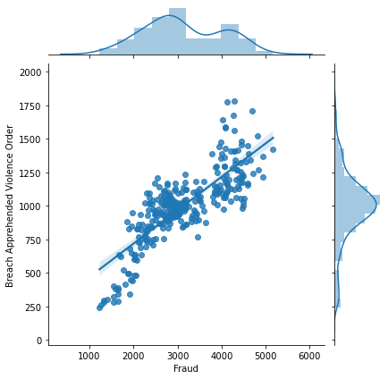


    
    


### Relationship between 'Fraud' and 'Breach bail conditions'


    There is a somewhat a weak positive correlation with a coefficient of 0.8951773846555591.
    


    
    


### Relationship between 'Fraud' and 'Transport regulatory offences'


    There is a somewhat a weak positive correlation with a coefficient of 0.8935437989087305.
    


    
    
    
    


# Crimes correlated with 'Other theft'


    Robbery without a weapon               0.918516
    Robbery with a weapon not a firearm    0.906301
    Break and enter dwelling               0.938519
    Break and enter non-dwelling           0.947188
    Motor vehicle theft                    0.909967
    Steal from motor vehicle               0.945934
    Steal from dwelling                    0.923760
    Breach bail conditions                -0.837358
    Name: Other theft, dtype: float64
    
    
    


    
    


### Relationship between 'Other theft' and 'Robbery without a weapon'


    There is a strong positive correlation with a coefficient of 0.9185155995771128.
    


    
    


### Relationship between 'Other theft' and 'Robbery with a weapon not a firearm'


    There is a strong positive correlation with a coefficient of 0.9063013764647229.
    


    
    


### Relationship between 'Other theft' and 'Break and enter dwelling'


    There is a strong positive correlation with a coefficient of 0.9385187271828259.
    


    
    


### Relationship between 'Other theft' and 'Break and enter non-dwelling'


    There is a strong positive correlation with a coefficient of 0.9471879016630308.
    


    
    


### Relationship between 'Other theft' and 'Motor vehicle theft'


    There is a strong positive correlation with a coefficient of 0.9099673856705823.
    


    
    


### Relationship between 'Other theft' and 'Steal from motor vehicle'


    There is a strong positive correlation with a coefficient of 0.945933641604323.
    


    
    


### Relationship between 'Other theft' and 'Steal from dwelling'


    There is a strong positive correlation with a coefficient of 0.9237602760012781.
    


    
    


### Relationship between 'Other theft' and 'Breach bail conditions'


    There is a strong negative correlation with a coefficient of 0.8373584836700806.
    


    
    
    
    


# Crimes correlated with 'Arson'


None


    
    
    
    


# Crimes correlated with 'Malicious damage to property'


None


    
    
    
    


# Crimes correlated with 'Possession and/or use of cocaine'


    Possession and/or use of amphetamines    0.894215
    Possession and/or use of other drugs     0.882943
    Dealing, trafficking in cocaine          0.851929
    Other drug offences                      0.867116
    Breach bail conditions                   0.822887
    Transport regulatory offences            0.818267
    Name: Possession and/or use of cocaine, dtype: float64
    
    
    


    
    


### Relationship between 'Possession and/or use of cocaine' and 'Possession and/or use of amphetamines'


    There is a somewhat a weak positive correlation with a coefficient of 0.8942153846397461.
    


    
    


### Relationship between 'Possession and/or use of cocaine' and 'Possession and/or use of other drugs'


    There is a somewhat a weak positive correlation with a coefficient of 0.8829434826754802.
    


    
    


### Relationship between 'Possession and/or use of cocaine' and 'Dealing, trafficking in cocaine'


    There is a somewhat a weak positive correlation with a coefficient of 0.851929198836673.
    


    
    


### Relationship between 'Possession and/or use of cocaine' and 'Other drug offences'


    There is a somewhat a weak positive correlation with a coefficient of 0.867116204558475.
    


    
    


### Relationship between 'Possession and/or use of cocaine' and 'Breach bail conditions'


    There is a somewhat a weak positive correlation with a coefficient of 0.8228870527311775.
    


    
    


### Relationship between 'Possession and/or use of cocaine' and 'Transport regulatory offences'


    There is a somewhat a weak positive correlation with a coefficient of 0.8182670469892381.
    


    
    
    
    


# Crimes correlated with 'Possession and/or use of narcotics'


None


    
    
    
    


# Crimes correlated with 'Possession and/or use of cannabis'


    Fraud                                    0.831236
    Possession and/or use of amphetamines    0.850545
    Possession and/or use of other drugs     0.829817
    Other drug offences                      0.869575
    Breach bail conditions                   0.825329
    Transport regulatory offences            0.832321
    Name: Possession and/or use of cannabis, dtype: float64
    
    
    


    
    


### Relationship between 'Possession and/or use of cannabis' and 'Fraud'


    There is a somewhat a weak positive correlation with a coefficient of 0.8312363974265078.
    


    
    


### Relationship between 'Possession and/or use of cannabis' and 'Possession and/or use of amphetamines'


    There is a somewhat a weak positive correlation with a coefficient of 0.8505451816446918.
    


    
    


### Relationship between 'Possession and/or use of cannabis' and 'Possession and/or use of other drugs'


    There is a somewhat a weak positive correlation with a coefficient of 0.8298167265121841.
    


    
    


### Relationship between 'Possession and/or use of cannabis' and 'Other drug offences'


    There is a somewhat a weak positive correlation with a coefficient of 0.8695748583638453.
    


    
    


### Relationship between 'Possession and/or use of cannabis' and 'Breach bail conditions'


    There is a somewhat a weak positive correlation with a coefficient of 0.8253294938148135.
    


    
    


### Relationship between 'Possession and/or use of cannabis' and 'Transport regulatory offences'


    There is a somewhat a weak positive correlation with a coefficient of 0.8323214970359634.
    


    
    
    
    


# Crimes correlated with 'Possession and/or use of amphetamines'


    Robbery without a weapon                    -0.802590
    Fraud                                        0.875821
    Possession and/or use of cocaine             0.894215
    Possession and/or use of cannabis            0.850545
    Possession and/or use of other drugs         0.930976
    Dealing, trafficking in amphetamines         0.824098
    Other drug offences                          0.921026
    Prohibited and regulated weapons offences    0.852840
    Pornography offences                         0.882410
    Breach bail conditions                       0.899315
    Transport regulatory offences                0.927624
    Name: Possession and/or use of amphetamines, dtype: float64
    
    
    


    
    


### Relationship between 'Possession and/or use of amphetamines' and 'Robbery without a weapon'


    There is a strong negative correlation with a coefficient of 0.8025897603176827.
    


    
    


### Relationship between 'Possession and/or use of amphetamines' and 'Fraud'


    There is a somewhat a weak positive correlation with a coefficient of 0.875820999114385.
    


    
    


### Relationship between 'Possession and/or use of amphetamines' and 'Possession and/or use of cocaine'


    There is a somewhat a weak positive correlation with a coefficient of 0.8942153846397461.
    


    
    


### Relationship between 'Possession and/or use of amphetamines' and 'Possession and/or use of cannabis'


    There is a somewhat a weak positive correlation with a coefficient of 0.8505451816446918.
    


    
    


### Relationship between 'Possession and/or use of amphetamines' and 'Possession and/or use of other drugs'


    There is a strong positive correlation with a coefficient of 0.930976217358415.
    


    
    


### Relationship between 'Possession and/or use of amphetamines' and 'Dealing, trafficking in amphetamines'


    There is a somewhat a weak positive correlation with a coefficient of 0.8240980796107945.
    


    
    


### Relationship between 'Possession and/or use of amphetamines' and 'Other drug offences'


    There is a strong positive correlation with a coefficient of 0.921025722590242.
    


    
    


### Relationship between 'Possession and/or use of amphetamines' and 'Prohibited and regulated weapons offences'


    There is a somewhat a weak positive correlation with a coefficient of 0.852840020191099.
    


    
    


### Relationship between 'Possession and/or use of amphetamines' and 'Pornography offences'


    There is a somewhat a weak positive correlation with a coefficient of 0.8824100326234755.
    


    
    


### Relationship between 'Possession and/or use of amphetamines' and 'Breach bail conditions'


    There is a somewhat a weak positive correlation with a coefficient of 0.8993147599192364.
    


    
    


### Relationship between 'Possession and/or use of amphetamines' and 'Transport regulatory offences'


    There is a strong positive correlation with a coefficient of 0.9276237747326727.
    


    
    
    
    


# Crimes correlated with 'Possession and/or use of ecstasy'


    Breach bail conditions    0.812243
    Name: Possession and/or use of ecstasy, dtype: float64
    
    
    


    
    


### Relationship between 'Possession and/or use of ecstasy' and 'Breach bail conditions'


    There is a somewhat a weak positive correlation with a coefficient of 0.8122427327620817.
    


    
    
    
    


# Crimes correlated with 'Possession and/or use of other drugs'


    Sexual assault                           0.845602
    Robbery without a weapon                -0.875181
    Intimidation, stalking and harassment    0.848191
    Break and enter dwelling                -0.847933
    Break and enter non-dwelling            -0.860131
    Motor vehicle theft                     -0.838787
    Fraud                                    0.881772
    Possession and/or use of cocaine         0.882943
    Possession and/or use of cannabis        0.829817
    Possession and/or use of amphetamines    0.930976
    Dealing, trafficking in other drugs      0.818325
    Other drug offences                      0.943122
    Pornography offences                     0.915792
    Breach bail conditions                   0.958184
    Transport regulatory offences            0.913128
    Name: Possession and/or use of other drugs, dtype: float64
    
    
    


    
    


### Relationship between 'Possession and/or use of other drugs' and 'Sexual assault'


    There is a somewhat a weak positive correlation with a coefficient of 0.8456016331276149.
    


    
    


### Relationship between 'Possession and/or use of other drugs' and 'Robbery without a weapon'


    There is a strong negative correlation with a coefficient of 0.8751809774001182.
    


    
    


### Relationship between 'Possession and/or use of other drugs' and 'Intimidation, stalking and harassment'


    There is a somewhat a weak positive correlation with a coefficient of 0.848190580081845.
    


    
    


### Relationship between 'Possession and/or use of other drugs' and 'Break and enter dwelling'


    There is a strong negative correlation with a coefficient of 0.8479331162880707.
    


    
    


### Relationship between 'Possession and/or use of other drugs' and 'Break and enter non-dwelling'


    There is a strong negative correlation with a coefficient of 0.8601313226615952.
    


    
    


### Relationship between 'Possession and/or use of other drugs' and 'Motor vehicle theft'


    There is a strong negative correlation with a coefficient of 0.8387873597266658.
    


    
    


### Relationship between 'Possession and/or use of other drugs' and 'Fraud'


    There is a somewhat a weak positive correlation with a coefficient of 0.8817718871234341.
    


    
    


### Relationship between 'Possession and/or use of other drugs' and 'Possession and/or use of cocaine'


    There is a somewhat a weak positive correlation with a coefficient of 0.8829434826754802.
    


    
    


### Relationship between 'Possession and/or use of other drugs' and 'Possession and/or use of cannabis'


    There is a somewhat a weak positive correlation with a coefficient of 0.8298167265121841.
    


    
    


### Relationship between 'Possession and/or use of other drugs' and 'Possession and/or use of amphetamines'


    There is a strong positive correlation with a coefficient of 0.930976217358415.
    


    
    


### Relationship between 'Possession and/or use of other drugs' and 'Dealing, trafficking in other drugs'


    There is a somewhat a weak positive correlation with a coefficient of 0.8183249249224902.
    


    
    


### Relationship between 'Possession and/or use of other drugs' and 'Other drug offences'


    There is a strong positive correlation with a coefficient of 0.9431215682199905.
    


    
    


### Relationship between 'Possession and/or use of other drugs' and 'Pornography offences'


    There is a strong positive correlation with a coefficient of 0.9157919664975513.
    


    
    


### Relationship between 'Possession and/or use of other drugs' and 'Breach bail conditions'


    There is a strong positive correlation with a coefficient of 0.9581844837283917.
    


    
    


### Relationship between 'Possession and/or use of other drugs' and 'Transport regulatory offences'


    There is a strong positive correlation with a coefficient of 0.9131277344404737.
    


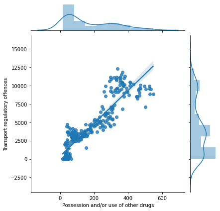


    
    
    
    


# Crimes correlated with 'Dealing, trafficking in cocaine'


    Possession and/or use of cocaine    0.851929
    Name: Dealing, trafficking in cocaine, dtype: float64
    
    
    


    
    


### Relationship between 'Dealing, trafficking in cocaine' and 'Possession and/or use of cocaine'


    There is a somewhat a weak positive correlation with a coefficient of 0.851929198836673.
    


    
    
    
    


# Crimes correlated with 'Dealing, trafficking in narcotics'


None


    
    
    
    


# Crimes correlated with 'Dealing, trafficking in cannabis'


None


    
    
    
    


# Crimes correlated with 'Dealing, trafficking in amphetamines'


    Possession and/or use of amphetamines    0.824098
    Name: Dealing, trafficking in amphetamines, dtype: float64
    
    
    


    
    


### Relationship between 'Dealing, trafficking in amphetamines' and 'Possession and/or use of amphetamines'


    There is a somewhat a weak positive correlation with a coefficient of 0.8240980796107945.
    


    
    
    
    


# Crimes correlated with 'Dealing, trafficking in ecstasy'


None


    
    
    
    


# Crimes correlated with 'Dealing, trafficking in other drugs'


    Possession and/or use of other drugs    0.818325
    Name: Dealing, trafficking in other drugs, dtype: float64
    
    
    


    
    


### Relationship between 'Dealing, trafficking in other drugs' and 'Possession and/or use of other drugs'


    There is a somewhat a weak positive correlation with a coefficient of 0.8183249249224902.
    


    
    
    
    


# Crimes correlated with 'Cultivating cannabis'


None


    
    
    
    


# Crimes correlated with 'Manufacture drug'


None


    
    
    
    


# Crimes correlated with 'Importing drugs'


None


    
    
    
    


# Crimes correlated with 'Other drug offences'


    Sexual assault                           0.809643
    Fraud                                    0.862454
    Possession and/or use of cocaine         0.867116
    Possession and/or use of cannabis        0.869575
    Possession and/or use of amphetamines    0.921026
    Possession and/or use of other drugs     0.943122
    Pornography offences                     0.871989
    Breach bail conditions                   0.893320
    Transport regulatory offences            0.870795
    Name: Other drug offences, dtype: float64
    
    
    


    
    


### Relationship between 'Other drug offences' and 'Sexual assault'


    There is a somewhat a weak positive correlation with a coefficient of 0.8096427611461977.
    


    
    


### Relationship between 'Other drug offences' and 'Fraud'


    There is a somewhat a weak positive correlation with a coefficient of 0.8624537886795403.
    


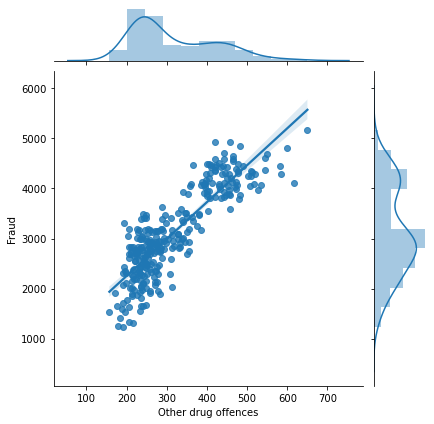


    
    


### Relationship between 'Other drug offences' and 'Possession and/or use of cocaine'


    There is a somewhat a weak positive correlation with a coefficient of 0.867116204558475.
    


    
    


### Relationship between 'Other drug offences' and 'Possession and/or use of cannabis'


    There is a somewhat a weak positive correlation with a coefficient of 0.8695748583638453.
    


    
    


### Relationship between 'Other drug offences' and 'Possession and/or use of amphetamines'


    There is a strong positive correlation with a coefficient of 0.921025722590242.
    


    
    


### Relationship between 'Other drug offences' and 'Possession and/or use of other drugs'


    There is a strong positive correlation with a coefficient of 0.9431215682199905.
    


    
    


### Relationship between 'Other drug offences' and 'Pornography offences'


    There is a somewhat a weak positive correlation with a coefficient of 0.8719888162294246.
    


    
    


### Relationship between 'Other drug offences' and 'Breach bail conditions'


    There is a somewhat a weak positive correlation with a coefficient of 0.8933197393166737.
    


    
    


### Relationship between 'Other drug offences' and 'Transport regulatory offences'


    There is a somewhat a weak positive correlation with a coefficient of 0.8707953059725569.
    


    
    
    
    


# Crimes correlated with 'Prohibited and regulated weapons offences'


    Possession and/or use of amphetamines    0.852840
    Breach Apprehended Violence Order        0.849749
    Name: Prohibited and regulated weapons offences, dtype: float64
    
    
    


    
    


### Relationship between 'Prohibited and regulated weapons offences' and 'Possession and/or use of amphetamines'


    There is a somewhat a weak positive correlation with a coefficient of 0.852840020191099.
    


    
    


### Relationship between 'Prohibited and regulated weapons offences' and 'Breach Apprehended Violence Order'


    There is a somewhat a weak positive correlation with a coefficient of 0.8497486401473312.
    


    
    
    
    


# Crimes correlated with 'Trespass'


    Domestic violence related assault        0.903188
    Intimidation, stalking and harassment    0.895179
    Breach Apprehended Violence Order        0.889648
    Name: Trespass, dtype: float64
    
    
    


    
    


### Relationship between 'Trespass' and 'Domestic violence related assault'


    There is a strong positive correlation with a coefficient of 0.9031875068224001.
    


    
    


### Relationship between 'Trespass' and 'Intimidation, stalking and harassment'


    There is a somewhat a weak positive correlation with a coefficient of 0.8951787685762429.
    


    
    


### Relationship between 'Trespass' and 'Breach Apprehended Violence Order'


    There is a somewhat a weak positive correlation with a coefficient of 0.889647782773851.
    


    
    
    
    


# Crimes correlated with 'Offensive conduct'


    Liquor offences    0.872866
    Name: Offensive conduct, dtype: float64
    
    
    


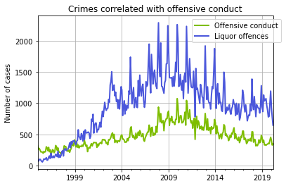


    
    


### Relationship between 'Offensive conduct' and 'Liquor offences'


    There is a somewhat a weak positive correlation with a coefficient of 0.8728662622260364.
    


    
    
    
    


# Crimes correlated with 'Offensive language'


None


    
    
    
    


# Crimes correlated with 'Criminal intent'


None


    
    
    
    


# Crimes correlated with 'Betting and gaming offences'


None


    
    
    
    


# Crimes correlated with 'Liquor offences'


    Offensive conduct    0.872866
    Name: Liquor offences, dtype: float64
    
    
    


    
    


### Relationship between 'Liquor offences' and 'Offensive conduct'


    There is a somewhat a weak positive correlation with a coefficient of 0.8728662622260364.
    


    
    
    
    


# Crimes correlated with 'Pornography offences'


    Sexual assault                           0.816202
    Robbery without a weapon                -0.848525
    Intimidation, stalking and harassment    0.808612
    Break and enter dwelling                -0.828893
    Break and enter non-dwelling            -0.837532
    Motor vehicle theft                     -0.819670
    Fraud                                    0.862459
    Possession and/or use of amphetamines    0.882410
    Possession and/or use of other drugs     0.915792
    Other drug offences                      0.871989
    Breach bail conditions                   0.899145
    Transport regulatory offences            0.891936
    Name: Pornography offences, dtype: float64
    
    
    


    
    


### Relationship between 'Pornography offences' and 'Sexual assault'


    There is a somewhat a weak positive correlation with a coefficient of 0.8162018238764369.
    


    
    


### Relationship between 'Pornography offences' and 'Robbery without a weapon'


    There is a strong negative correlation with a coefficient of 0.8485247584183891.
    


    
    


### Relationship between 'Pornography offences' and 'Intimidation, stalking and harassment'


    There is a somewhat a weak positive correlation with a coefficient of 0.8086123367997449.
    


    
    


### Relationship between 'Pornography offences' and 'Break and enter dwelling'


    There is a strong negative correlation with a coefficient of 0.8288934022621853.
    


    
    


### Relationship between 'Pornography offences' and 'Break and enter non-dwelling'


    There is a strong negative correlation with a coefficient of 0.8375319585133986.
    


    
    


### Relationship between 'Pornography offences' and 'Motor vehicle theft'


    There is a strong negative correlation with a coefficient of 0.8196704561442802.
    


    
    


### Relationship between 'Pornography offences' and 'Fraud'


    There is a somewhat a weak positive correlation with a coefficient of 0.8624586729069823.
    


    
    


### Relationship between 'Pornography offences' and 'Possession and/or use of amphetamines'


    There is a somewhat a weak positive correlation with a coefficient of 0.8824100326234755.
    


    
    


### Relationship between 'Pornography offences' and 'Possession and/or use of other drugs'


    There is a strong positive correlation with a coefficient of 0.9157919664975513.
    


    
    


### Relationship between 'Pornography offences' and 'Other drug offences'


    There is a somewhat a weak positive correlation with a coefficient of 0.8719888162294246.
    


    
    


### Relationship between 'Pornography offences' and 'Breach bail conditions'


    There is a somewhat a weak positive correlation with a coefficient of 0.8991449438279697.
    


    
    


### Relationship between 'Pornography offences' and 'Transport regulatory offences'


    There is a somewhat a weak positive correlation with a coefficient of 0.8919356576853442.
    


    
    
    
    


# Crimes correlated with 'Prostitution offences'


None


    
    
    
    


# Crimes correlated with 'Escape custody'


None


    
    
    
    


# Crimes correlated with 'Breach Apprehended Violence Order'


    Domestic violence related assault            0.915471
    Sexual assault                               0.802285
    Intimidation, stalking and harassment        0.857452
    Fraud                                        0.811376
    Prohibited and regulated weapons offences    0.849749
    Trespass                                     0.889648
    Breach bail conditions                       0.803790
    Name: Breach Apprehended Violence Order, dtype: float64
    
    
    


    
    


### Relationship between 'Breach Apprehended Violence Order' and 'Domestic violence related assault'


    There is a strong positive correlation with a coefficient of 0.9154707865426196.
    


    
    


### Relationship between 'Breach Apprehended Violence Order' and 'Sexual assault'


    There is a somewhat a weak positive correlation with a coefficient of 0.8022849930996498.
    


    
    


### Relationship between 'Breach Apprehended Violence Order' and 'Intimidation, stalking and harassment'


    There is a somewhat a weak positive correlation with a coefficient of 0.8574515894111203.
    


    
    


### Relationship between 'Breach Apprehended Violence Order' and 'Fraud'


    There is a somewhat a weak positive correlation with a coefficient of 0.8113756155119592.
    


    
    


### Relationship between 'Breach Apprehended Violence Order' and 'Prohibited and regulated weapons offences'


    There is a somewhat a weak positive correlation with a coefficient of 0.8497486401473312.
    


    
    


### Relationship between 'Breach Apprehended Violence Order' and 'Trespass'


    There is a somewhat a weak positive correlation with a coefficient of 0.889647782773851.
    


    
    


### Relationship between 'Breach Apprehended Violence Order' and 'Breach bail conditions'


    There is a somewhat a weak positive correlation with a coefficient of 0.8037895570290507.
    


    
    
    
    


# Crimes correlated with 'Breach bail conditions'


    Sexual assault                           0.836366
    Robbery without a weapon                -0.886626
    Robbery with a firearm                  -0.840473
    Intimidation, stalking and harassment    0.923936
    Break and enter dwelling                -0.907632
    Break and enter non-dwelling            -0.920987
    Motor vehicle theft                     -0.912720
    Steal from motor vehicle                -0.814355
    Fraud                                    0.895177
    Other theft                             -0.837358
    Possession and/or use of cocaine         0.822887
    Possession and/or use of cannabis        0.825329
    Possession and/or use of amphetamines    0.899315
    Possession and/or use of ecstasy         0.812243
    Possession and/or use of other drugs     0.958184
    Other drug offences                      0.893320
    Pornography offences                     0.899145
    Breach Apprehended Violence Order        0.803790
    Transport regulatory offences            0.929101
    Name: Breach bail conditions, dtype: float64
    
    
    


    
    


### Relationship between 'Breach bail conditions' and 'Sexual assault'


    There is a somewhat a weak positive correlation with a coefficient of 0.8363661185268287.
    


    
    


### Relationship between 'Breach bail conditions' and 'Robbery without a weapon'


    There is a strong negative correlation with a coefficient of 0.8866257173115341.
    


    
    


### Relationship between 'Breach bail conditions' and 'Robbery with a firearm'


    There is a strong negative correlation with a coefficient of 0.8404734856607098.
    


    
    


### Relationship between 'Breach bail conditions' and 'Intimidation, stalking and harassment'


    There is a strong positive correlation with a coefficient of 0.9239357693463738.
    


    
    


### Relationship between 'Breach bail conditions' and 'Break and enter dwelling'


    There is a somewhat a weak negative correlation with a coefficient of 0.9076319585976834.
    


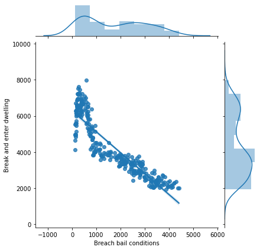


    
    


### Relationship between 'Breach bail conditions' and 'Break and enter non-dwelling'


    There is a somewhat a weak negative correlation with a coefficient of 0.9209873143828042.
    


    
    


### Relationship between 'Breach bail conditions' and 'Motor vehicle theft'


    There is a somewhat a weak negative correlation with a coefficient of 0.9127201143294046.
    


    
    


### Relationship between 'Breach bail conditions' and 'Steal from motor vehicle'


    There is a strong negative correlation with a coefficient of 0.8143554703688323.
    


    
    


### Relationship between 'Breach bail conditions' and 'Fraud'


    There is a somewhat a weak positive correlation with a coefficient of 0.8951773846555591.
    


    
    


### Relationship between 'Breach bail conditions' and 'Other theft'


    There is a strong negative correlation with a coefficient of 0.8373584836700806.
    


    
    


### Relationship between 'Breach bail conditions' and 'Possession and/or use of cocaine'


    There is a somewhat a weak positive correlation with a coefficient of 0.8228870527311775.
    


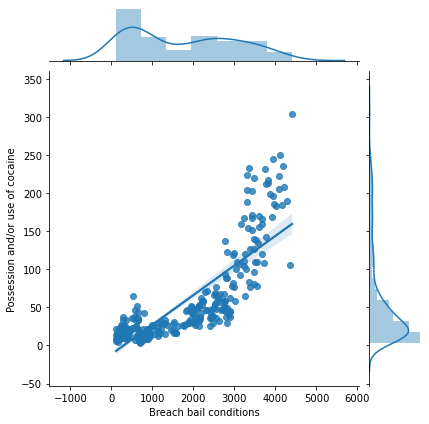


    
    


### Relationship between 'Breach bail conditions' and 'Possession and/or use of cannabis'


    There is a somewhat a weak positive correlation with a coefficient of 0.8253294938148135.
    


    
    


### Relationship between 'Breach bail conditions' and 'Possession and/or use of amphetamines'


    There is a somewhat a weak positive correlation with a coefficient of 0.8993147599192364.
    


    
    


### Relationship between 'Breach bail conditions' and 'Possession and/or use of ecstasy'


    There is a somewhat a weak positive correlation with a coefficient of 0.8122427327620817.
    


    
    


### Relationship between 'Breach bail conditions' and 'Possession and/or use of other drugs'


    There is a strong positive correlation with a coefficient of 0.9581844837283917.
    


    
    


### Relationship between 'Breach bail conditions' and 'Other drug offences'


    There is a somewhat a weak positive correlation with a coefficient of 0.8933197393166737.
    


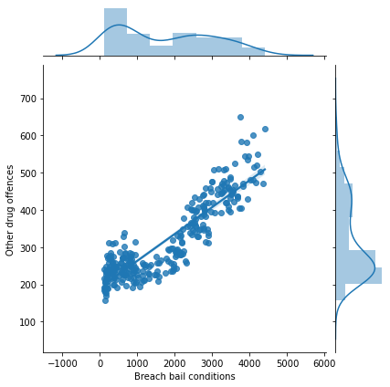


    
    


### Relationship between 'Breach bail conditions' and 'Pornography offences'


    There is a somewhat a weak positive correlation with a coefficient of 0.8991449438279697.
    


    
    


### Relationship between 'Breach bail conditions' and 'Breach Apprehended Violence Order'


    There is a somewhat a weak positive correlation with a coefficient of 0.8037895570290507.
    


    
    


### Relationship between 'Breach bail conditions' and 'Transport regulatory offences'


    There is a strong positive correlation with a coefficient of 0.9291009204148086.
    


    
    
    
    


# Crimes correlated with 'Fail to appear'


    Motor vehicle theft    0.80688
    Name: Fail to appear, dtype: float64
    
    
    


    
    


### Relationship between 'Fail to appear' and 'Motor vehicle theft'


    There is a somewhat a weak positive correlation with a coefficient of 0.806879518404141.
    


    
    
    
    


# Crimes correlated with 'Resist or hinder officer'


None


    
    
    
    


# Crimes correlated with 'Other offences against justice procedures'


None


    
    
    
    


# Crimes correlated with 'Transport regulatory offences'


    Sexual assault                           0.824175
    Robbery without a weapon                -0.866168
    Robbery with a firearm                  -0.804545
    Intimidation, stalking and harassment    0.835347
    Break and enter dwelling                -0.873356
    Break and enter non-dwelling            -0.875404
    Motor vehicle theft                     -0.875050
    Fraud                                    0.893544
    Possession and/or use of cocaine         0.818267
    Possession and/or use of cannabis        0.832321
    Possession and/or use of amphetamines    0.927624
    Possession and/or use of other drugs     0.913128
    Other drug offences                      0.870795
    Pornography offences                     0.891936
    Breach bail conditions                   0.929101
    Name: Transport regulatory offences, dtype: float64
    
    
    


    
    


### Relationship between 'Transport regulatory offences' and 'Sexual assault'


    There is a somewhat a weak positive correlation with a coefficient of 0.8241745573416319.
    


    
    


### Relationship between 'Transport regulatory offences' and 'Robbery without a weapon'


    There is a strong negative correlation with a coefficient of 0.8661682767094265.
    


    
    


### Relationship between 'Transport regulatory offences' and 'Robbery with a firearm'


    There is a strong negative correlation with a coefficient of 0.804544580471433.
    


    
    


### Relationship between 'Transport regulatory offences' and 'Intimidation, stalking and harassment'


    There is a somewhat a weak positive correlation with a coefficient of 0.8353471396745816.
    


    
    


### Relationship between 'Transport regulatory offences' and 'Break and enter dwelling'


    There is a strong negative correlation with a coefficient of 0.8733563053584978.
    


    
    


### Relationship between 'Transport regulatory offences' and 'Break and enter non-dwelling'


    There is a strong negative correlation with a coefficient of 0.8754036135187221.
    


    
    


### Relationship between 'Transport regulatory offences' and 'Motor vehicle theft'


    There is a strong negative correlation with a coefficient of 0.8750496127361973.
    


    
    


### Relationship between 'Transport regulatory offences' and 'Fraud'


    There is a somewhat a weak positive correlation with a coefficient of 0.8935437989087305.
    


    
    


### Relationship between 'Transport regulatory offences' and 'Possession and/or use of cocaine'


    There is a somewhat a weak positive correlation with a coefficient of 0.8182670469892381.
    


    
    


### Relationship between 'Transport regulatory offences' and 'Possession and/or use of cannabis'


    There is a somewhat a weak positive correlation with a coefficient of 0.8323214970359634.
    


    
    


### Relationship between 'Transport regulatory offences' and 'Possession and/or use of amphetamines'


    There is a strong positive correlation with a coefficient of 0.9276237747326727.
    


    
    


### Relationship between 'Transport regulatory offences' and 'Possession and/or use of other drugs'


    There is a strong positive correlation with a coefficient of 0.9131277344404737.
    


    
    


### Relationship between 'Transport regulatory offences' and 'Other drug offences'


    There is a somewhat a weak positive correlation with a coefficient of 0.8707953059725569.
    


    
    


### Relationship between 'Transport regulatory offences' and 'Pornography offences'


    There is a somewhat a weak positive correlation with a coefficient of 0.8919356576853442.
    


    
    


### Relationship between 'Transport regulatory offences' and 'Breach bail conditions'


    There is a strong positive correlation with a coefficient of 0.9291009204148086.
    


    
    
    
    


# Crimes correlated with 'Other offences'


None


    
    
    
    
